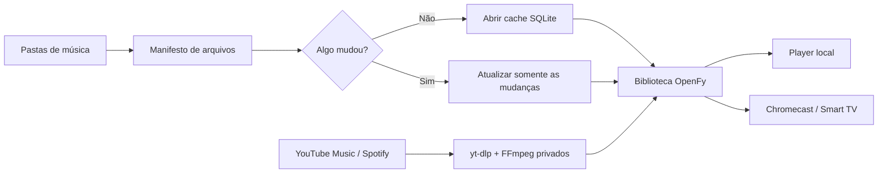

<div align="center">
  
</div>

<div align="center">

[](https://github.com/antonioneris/openfy/releases/latest)
[](https://github.com/antonioneris/openfy/actions/workflows/ci.yml)
[](https://www.electronjs.org/)
[](#instalação)
[](LICENSE)

**Um player desktop para ouvir sua biblioteca local, descobrir músicas, baixar faixas e transmitir para a TV — sem depender de uma assinatura.**

[Instalação](#instalação) · [Recursos](#recursos) · [Primeiros passos](#primeiros-passos) · [Desenvolvimento](#desenvolvimento) · [Contribuir](#contribuindo)

</div>

---

## Por que o OpenFy?

Sua biblioteca musical deve abrir instantaneamente e continuar sendo sua. O OpenFy indexa os arquivos em um banco SQLite local, reutiliza esse cache nas próximas execuções e só reprocessa o que realmente mudou. Busca, downloads, playlists, letras e transmissão ficam reunidos em uma interface desktop feita para bibliotecas grandes.

<table>
  <tr>
    <td width="33%"><strong>⚡ Biblioteca instantânea</strong><br>Abre pelo cache SQLite e verifica mudanças em segundo plano, sem reler metadados de todas as músicas.</td>
    <td width="33%"><strong>🔒 Arquivos sob seu controle</strong><br>Músicas, banco, playlists e ferramentas auxiliares permanecem no computador do usuário.</td>
    <td width="33%"><strong>📺 Chromecast integrado</strong><br>Descobre dispositivos na rede e transmite áudio, capa, estado do player e letras sincronizadas.</td>
  </tr>
  <tr>
    <td><strong>⬇️ Downloads completos</strong><br>Busca no YouTube Music, importa links do Spotify e organiza áudio, capa, metadados e letras.</td>
    <td><strong>🧰 Zero instalação manual</strong><br>FFmpeg, FFprobe e yt-dlp são baixados para a pasta privada do app conforme sistema e arquitetura.</td>
    <td><strong>🎛️ Player de verdade</strong><br>Fila, aleatório, repetição, favoritos, histórico, mini player, tela cheia e mixtapes locais.</td>
  </tr>
</table>

## Visão geral



- Reproduz MP3, M4A, FLAC, OGG, WAV e AAC.
- Organiza músicas por artista, álbum, gênero, pasta, favoritos e histórico.
- Mantém playlists e estatísticas em SQLite local.
- Lê letras LRC e letras embutidas, com acompanhamento sincronizado.
- Pesquisa músicas, álbuns e playlists no YouTube Music.
- Resolve links de faixas, álbuns e playlists do Spotify.
- Baixa áudio com capa, tags e letra sem exigir FFmpeg ou yt-dlp global.
- Cria Supermix, Descobertas e mixes por gênero e década.
- Oferece mini player, fila, modo tela cheia e controles multimídia.
- Descobre Chromecasts por mDNS e oferece uma página para AirPlay/Smart TV.

## Instalação

Não é necessário instalar Node.js, FFmpeg ou yt-dlp para usar o aplicativo. Baixe o pacote do seu sistema em [Releases](https://github.com/antonioneris/openfy/releases/latest).

| Sistema | Pacote | Arquitetura |
|---|---|---|
| macOS | `.dmg` | Intel e Apple Silicon |
| Windows | instalador NSIS ou portátil `.exe` | x64 |
| Linux | `.AppImage` ou `.deb` | x64 |

Cada release publica `SHA256SUMS.txt` para conferência dos arquivos. Os builds ainda podem apresentar um aviso do sistema operacional enquanto não houver assinatura e notarização oficiais.

### Ferramentas privadas do player

Na primeira abertura, o OpenFy detecta sistema e arquitetura e baixa os binários oficiais compatíveis:

- `yt-dlp`, a partir dos releases oficiais do projeto;
- `ffmpeg` e `ffprobe`, a partir dos binários estáticos publicados no GitHub.

Eles ficam em `userData/bin`, a pasta privada da aplicação. O OpenFy não instala pacotes globalmente, não altera o `PATH` e sempre executa os binários desse diretório conhecido.

## Primeiros passos

1. Abra o OpenFy e escolha **Adicionar pasta**.
2. Selecione a pasta que contém suas músicas.
3. Aguarde a primeira indexação; as próximas aberturas usarão o banco local imediatamente.
4. Escolha uma faixa para iniciar a reprodução.
5. Para transmitir, clique no ícone Cast e selecione um dispositivo da mesma rede Wi-Fi.

### Importar ou baixar músicas

Abra **Buscar**, escolha a pesquisa do YouTube Music e procure pelo nome da música. Links do Spotify também podem ser colados diretamente. Antes do download, escolha a pasta de destino; o app cuidará do áudio, capa, metadados e letra disponível.

## Privacidade e segurança

- A biblioteca e as estatísticas permanecem locais.
- Caminhos autorizados são validados no processo principal antes de qualquer leitura.
- O renderer não recebe acesso direto e irrestrito ao Node.js.
- Downloads externos usam HTTPS e binários guardados na pasta privada da aplicação.
- Credenciais opcionais do Spotify ficam no armazenamento local do aplicativo.

> [!IMPORTANT]
> Pesquisas e downloads enviam os termos necessários ao YouTube Music, Spotify e serviços associados. Consulte as políticas desses serviços e respeite direitos autorais e regras locais.

## Solução de problemas

<details>
<summary><strong>A biblioteca demora ou aparece vazia</strong></summary>

Confirme que a pasta ainda existe e que o OpenFy continua autorizado a lê-la. Use **Configurações → Biblioteca → Reautorizar** quando a pasta tiver sido movida ou a permissão do sistema tiver mudado.

</details>

<details>
<summary><strong>Nenhum Chromecast aparece</strong></summary>

O computador e o dispositivo precisam estar na mesma rede, com descoberta mDNS permitida pelo roteador e firewall. Abra novamente o seletor Cast e clique em **Atualizar**.

</details>

<details>
<summary><strong>FFmpeg ou yt-dlp não foi preparado</strong></summary>

Verifique a conexão e reinicie o aplicativo. O OpenFy tentará baixar novamente apenas os binários ausentes para a pasta privada do player.

</details>

## Desenvolvimento

Requer Node.js 22 ou mais recente.

```bash
git clone https://github.com/antonioneris/openfy.git
cd openfy
npm ci
npm test -- --runInBand
npm run build
npm run electron:dev
```

Comandos principais:

| Comando | Função |
|---|---|
| `npm run electron:dev` | Compila e abre o aplicativo desktop |
| `npm run electron:dev:tools` | Abre o Electron com DevTools |
| `npm test -- --runInBand` | Executa os testes unitários |
| `npm run test:e2e` | Executa os testes Playwright |
| `npm run build` | Valida TypeScript e gera o renderer |
| `npm run electron:build` | Gera os pacotes para macOS |

Uma tag `v*` aciona a release automática. O workflow valida testes e build, empacota macOS, Windows e Linux, gera SHA-256 e publica os artefatos no GitHub Releases.

## Arquitetura

```text
Renderer (React + TypeScript)
  ├─ Contextos de biblioteca, player, fila, busca e downloads
  ├─ SQLite em WebAssembly para cache e persistência
  └─ preload.cjs: ponte IPC estritamente definida
          │
Main Process (Electron)
  ├─ IPC seguro para arquivos, banco, janelas e downloads
  ├─ Gerenciador privado de yt-dlp / FFmpeg / FFprobe
  ├─ Scanner assíncrono e cancelável de diretórios
  └─ Servidor local e descoberta Chromecast por mDNS
```

O código é organizado por domínio em `src/features`, enquanto integrações nativas ficam em `src/electron`.

## Roadmap

- [ ] Assinatura e notarização dos aplicativos publicados.
- [ ] Pacotes universais adicionais para Linux e Windows ARM64.
- [ ] Atualização automática opcional pelo próprio aplicativo.
- [ ] Mais provedores de metadados e letras.
- [ ] Sincronização opcional de playlists entre dispositivos.

Tem uma ideia? [Abra uma issue](https://github.com/antonioneris/openfy/issues/new) e descreva seu caso de uso.

## Contribuindo

Contribuições são bem-vindas — correções, testes, documentação, acessibilidade e novos recursos.

1. Faça um fork do repositório.
2. Crie uma branch: `git switch -c feat/minha-melhoria`.
3. Implemente a mudança e adicione testes.
4. Execute `npm test -- --runInBand` e `npm run build`.
5. Abra um Pull Request explicando o problema, a solução e como ela foi validada.

Não inclua credenciais, caminhos pessoais, bancos de biblioteca, músicas ou arquivos protegidos por direitos autorais.

## Licença

Distribuído sob a licença [MIT](LICENSE).

---

<div align="center">
  Sua biblioteca, seus arquivos, seu player.
  <br><br>
  <a href="https://github.com/antonioneris/openfy">⭐ Se o OpenFy melhorou sua biblioteca, considere deixar uma estrela.</a>
</div>
